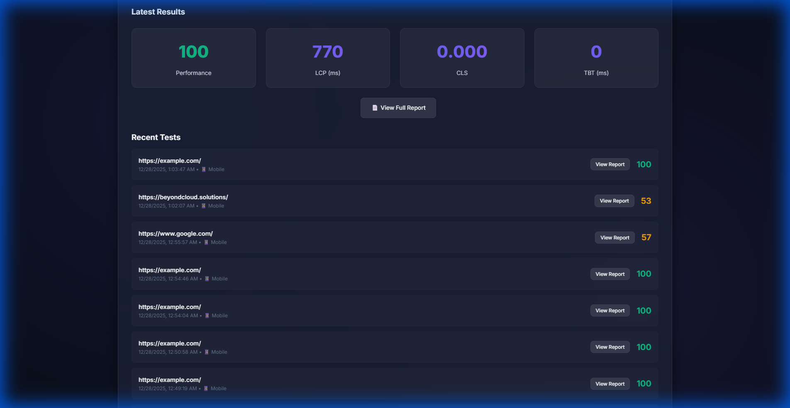
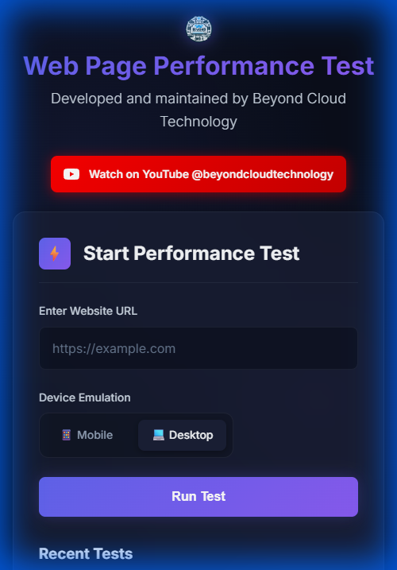

# Web Page Performance Test ⚡

<div align="center">

### Premium Real-Time Website Audit & Metrics Tool

[](https://web-page-performance-test.beyondcloud.technology/)

A modern, high-performance web analytics tool that allows users to run Google Lighthouse audits on any website. Built with Node.js, Express, and a custom-tuned Chrome instance for accurate, reproducible results.


[Features](#-essential-features) • [Visual Tour](#-visual-tour) • [Getting Started](#-getting-started) • [Deployment](#-deployment)

</div>

---

## ✨ Essential Features

*   **⚡ Core Web Vitals Analysis**: Comprehensive breakdown of LCP, CLS, and TBT metrics.
*   **📱 Multi-Device Emulation**: Toggle between Desktop (1920x1080) and Mobile (Moto G4) emulation modes.
*   **🔒 User Isolation & Privacy**:
    *   Test history is strictly isolated per user via client-side UUIDs.
    *   No shared history between different users.
*   **🚀 Concurrency Queue System**:
    *   Intelligent backend queue prevents server overload.
    *   Supports simultaneous users without crashing (FIFO processing).
*   **💾 Persistent History**: Automatically saves your recent test runs using a PostgreSQL database.
*   **📊 Detailed Reports**: Generates full HTML Lighthouse reports and JSON summaries.
*   **📸 Visual Filmstrip**: Captures frame-by-frame screenshots of the page load experience.

## 📸 Visual Tour

<div align="center">
  <h3>Desktop Analysis Results</h3>
  
  
  <br><br>

  <h3>Mobile Responsive Dashboard</h3>
  
</div>

## 🚀 Getting Started

### Prerequisites
*   Node.js v20+
*   Chromium / Google Chrome installed
*   PostgreSQL

### Installation

1.  Clone the repository:
    ```bash
    git clone https://github.com/DeNNiiInc/Web-Page-Performance-Test.git
    cd Web-Page-Performance-Test
    ```

2.  Install dependencies:
    ```bash
    npm install
    ```

3.  Apply Permissions (Optional):
    ```bash
    chmod +x config-fix.sh
    ```

4.  Start the server:
    ```bash
    npm start
    ```
    The application will run on `http://localhost:3000`.

## 🛠️ Deployment

This project includes automated deployment scripts for Proxmox/Linux environments.

*   **Automated Sync**: `auto-sync-robust.sh` handles pulling changes and restarting services only when necessary.
*   **Crednetial Safety**: `deploy-config.json` and `.env` files are strictly git-ignored.
*   **License**: Distributed under the **GPL-3.0** License.

---
<div align="center">
  <sub>Developed and maintained by Beyond Cloud Technology.</sub>
</div>
