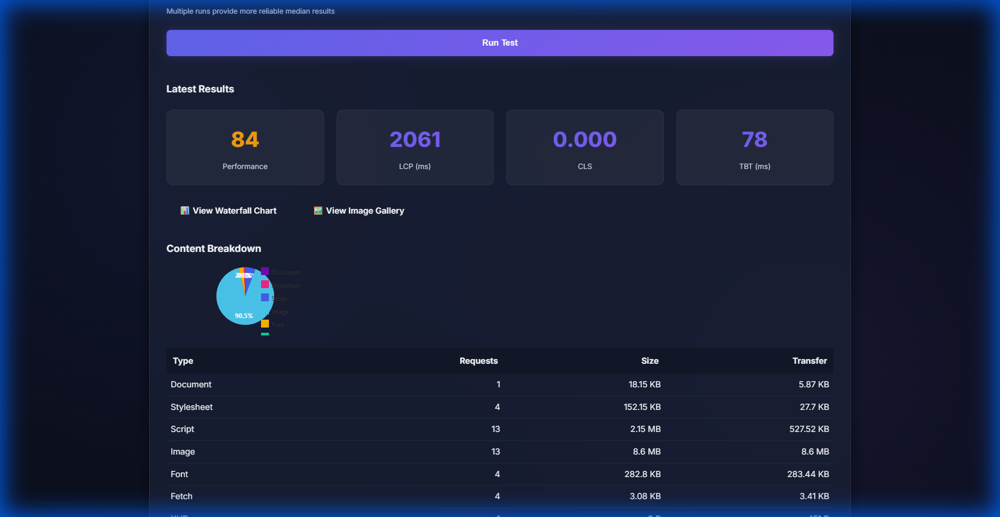
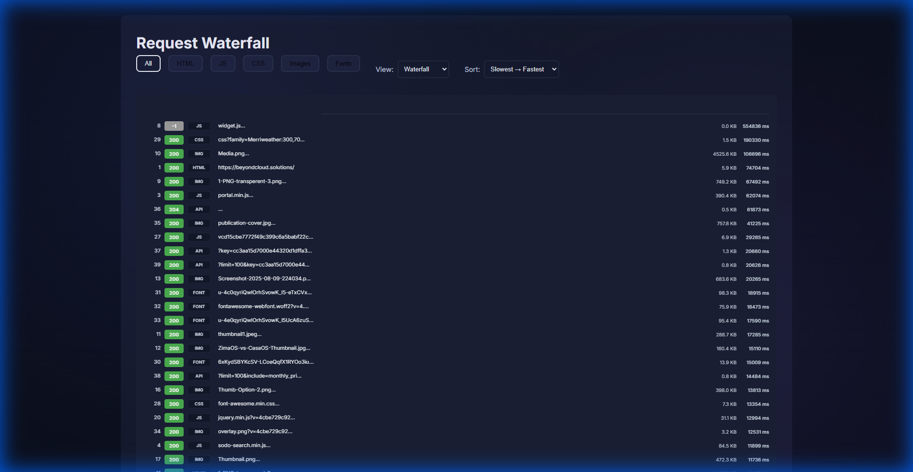
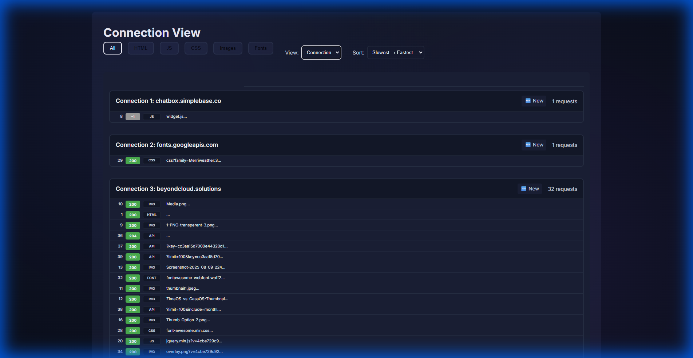
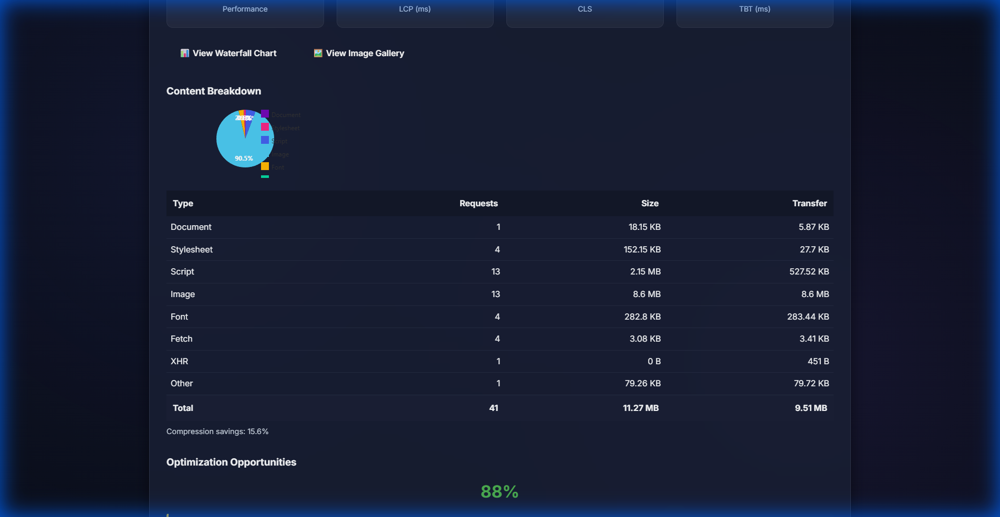
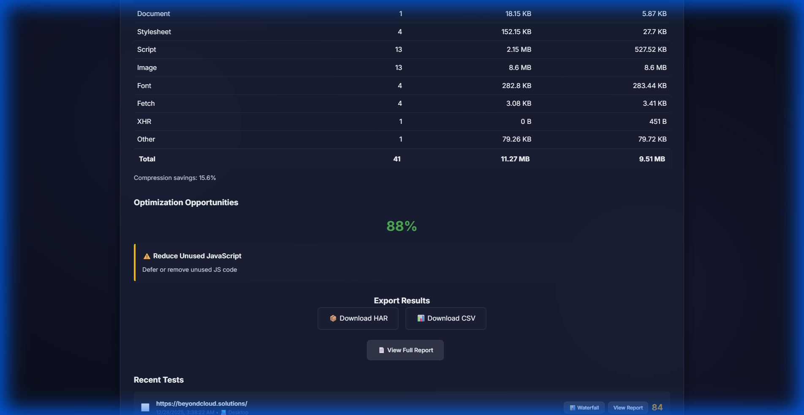
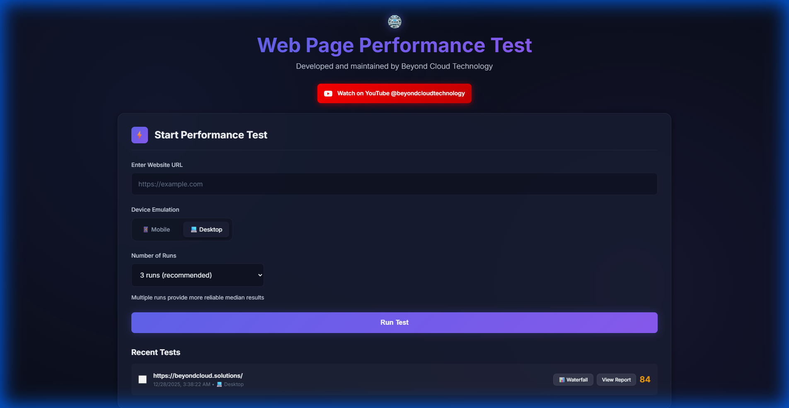

# Web Page Performance Test ⚡

<div align="center">

### Premium Real-Time Website Audit & Metrics Tool

[](https://web-page-performance-test.beyondcloud.technology/)

A modern, high-performance web analytics tool that allows users to run Google Lighthouse audits on any website. Built with Node.js, Express, and a custom-tuned Chrome instance for accurate, reproducible results.


[Features](#-comprehensive-features) • [Visual Tour](#-visual-tour) • [Getting Started](#-getting-started) • [Deployment](#-deployment)

</div>

---

## ✨ Comprehensive Features

### 🎯 **Multi-Run Statistics**
Run tests multiple times (1, 3, 5, or 10 runs) to get statistically significant results. The system automatically calculates:
- **Median Performance Score** ⭐ (identifies the most representative run)
- **Average & Standard Deviation** for all Core Web Vitals
- **Individual Run Comparison** with detailed metrics for each test

*Perfect for eliminating variance and getting reliable performance data.*

<div align="center">
  
</div>

---

### 📊 **Performance Grades (A-F)**
Industry-standard grading system for 6 critical metrics:
- **First Contentful Paint (FCP)** - When users first see content
- **Largest Contentful Paint (LCP)** - Main content rendering time
- **Cumulative Layout Shift (CLS)** - Visual stability score
- **Total Blocking Time (TBT)** - Interactivity delays
- **Speed Index** - How quickly content is visually displayed
- **Time to Interactive (TTI)** - When page becomes fully interactive

Each metric is color-coded (Green A → Red F) based on WebPageTest standards.

<div align="center">
  
</div>

---

### 📈 **Request Waterfall Chart**
Detailed visual timeline showing:
- **Sequential request loading** with precise timing
- **HTTP status codes** (200 = success, 404 = not found, etc.)
- **Resource types** (HTML, CSS, JS, Images, Fonts)
- **File sizes** and transfer times
- **Request/Response headers** for debugging
- **Vertical time grid** for easy time tracking

<div align="center">
  
</div>

---

### 🔗 **Connection View**
Advanced networking analysis that groups requests by their socket connection:
- **Connection Reuse Detection** (♻️ Reused vs 🆕 New)
- **HTTP/2 Multiplexing Visualization** - See parallel requests
- **Domain Grouping** - Identify third-party dependencies
- **Protocol Display** (HTTP/1.1, HTTP/2, HTTP/3)

*Helps optimize connection pooling and identify opportunities for HTTP/2 upgrades.*

<div align="center">
  
</div>

---

### 📦 **Content Breakdown Analysis**
Interactive pie chart and detailed table showing:
- **Resource Type Distribution** (Document, Stylesheet, Script, Image, Font, Other)
- **Request Count** per type
- **Total Size & Transfer Size** (before/after compression)
- **Optimization Opportunities** - Identifies large unoptimized images

<div align="center">
  
</div>

---

### 🖼️ **Image Gallery & Optimization**
Dedicated image analysis tool that displays:
- **All loaded images** with thumbnails
- **Format detection** (WebP, AVIF, PNG, JPEG, SVG, GIF)
- **Size warnings** for images over 100KB
- **Optimization suggestions** (e.g., "Switch to WebP for 30% savings")
- **Total statistics** (count, total size, average size)

---

### 🔄 **Test Comparison**
Select up to 10 previous tests and compare them side-by-side:
- **Performance score trends**
- **Core Web Vitals differences**
- **Page load time variations**
- **Resource count changes**

*Perfect for tracking performance improvements over time or A/B testing different configurations.*

---

### 🕰️ **Recent Tests with Clickable URLs**
Your test history, enhanced:
- **Click any website URL** to instantly reload previous results
- **Checkboxes for comparison** selection
- **Device indicators** (📱 Mobile / 💻 Desktop)
- **Performance scores** at a glance
- **Quick access buttons** (Waterfall, View Report)

<div align="center">
  
</div>

---

### 🔐 **Privacy & User Isolation**
- **Client-side UUID tracking** - Your tests stay yours
- **No shared history** between users
- **Automatic cleanup** - Old tests are periodically archived

---

### ⚙️ **Additional Features**
- **📱 Device Emulation** - Toggle between Desktop (1920x1080) and Mobile (Moto G4)
- **💾 Persistent Storage** - PostgreSQL database for reliable history
- **📄 Export Capabilities** - Download HAR files and JSON reports
- **🚀 Request Queue System** - Handles concurrent users without crashes
- **⏱️ Real-time Progress** - Live updates during multi-run tests
- **🎨 Dark Mode Interface** - Easy on the eyes, professional design

---

## 📸 Visual Tour

<div align="center">
  <h3>🖥️ Desktop Dashboard View</h3>
  
  <p><em>Full-featured dashboard showing test configuration, results, and analysis tools</em></p>
  
  <br><br>

  <h3>📱 Mobile Responsive Design</h3>
  
  <p><em>Fully optimized mobile experience - test on any device</em></p>
</div>

---

## 🚀 Getting Started

### Prerequisites
- **Node.js** v20 or higher
- **Google Chrome** or Chromium
- **PostgreSQL** 15+ (for test history)

### Installation

1. **Clone the repository:**
   ```bash
   git clone https://github.com/DeNNiiInc/Web-Page-Performance-Test.git
   cd Web-Page-Performance-Test
   ```

2. **Install dependencies:**
   ```bash
   npm install
   ```

3. **Configure the database:**
   - Update `lib/db-config.js` with your PostgreSQL credentials
   - Run migrations:
     ```bash
     cd migrations
     chmod +x run-migration.sh
     ./run-migration.sh
     ```

4. **Start the server:**
   ```bash
   npm start
   ```
   The application will run on `http://localhost:3000`

### Usage

1. **Enter a website URL** (e.g., `https://example.com`)
2. **Select device type** (Desktop or Mobile)
3. **Choose number of runs** (1 for quick test, 3-5 for reliable median)
4. **Click "Run Test"** and wait for results
5. **Explore the data:**
   - View performance grades and Core Web Vitals
   - Click "View Waterfall Chart" for detailed request timeline
   - Check "View Image Gallery" for optimization opportunities
   - Select tests to compare performance over time

---

## 🛠️ Deployment

This project includes automated deployment for production environments.

### Automated Deployment (Linux/Proxmox)
- **Auto-sync script** (`auto-sync-robust.sh`) pulls GitHub changes every 60 seconds
- **Systemd service** manages the Node.js application
- **Environment variables** stored in `.env` (git-ignored for security)
- **Graceful restarts** only when code changes are detected

### Manual Deployment
1. Pull latest code: `git pull origin main`
2. Install dependencies: `npm install`
3. Run migrations: `cd migrations && ./run-migration.sh`
4. Restart service: `systemctl restart web-page-performance-test`

### Configuration Files
- `lib/db-config.js` - Database connection settings
- `deploy-config.json` - Deployment credentials (git-ignored)
- `.env` - Environment variables (git-ignored)

---

## 🔧 Technology Stack

| Component | Technology |
|-----------|-----------|
| **Backend** | Node.js 20+ with Express 4.18+ |
| **Testing Engine** | Google Lighthouse 13.0+ |
| **Browser** | Chrome Launcher (headless) |
| **Database** | PostgreSQL 15+ |
| **Frontend** | Vanilla JavaScript, CSS3, HTML5 |
| **Charts** | Canvas-based custom rendering |
| **Analysis** | HAR file parsing, statistical calculations |

---

## 📝 License

Distributed under the **GPL-3.0** License. See `LICENSE` file for more information.

---

## 🤝 Contributing

Contributions, issues, and feature requests are welcome! Feel free to check the [issues page](https://github.com/DeNNiiInc/Web-Page-Performance-Test/issues).

---

## 📧 Support

For questions or support, please open an issue on GitHub or contact **Beyond Cloud Technology**.

---

<div align="center">
  <sub>Developed and maintained by <strong>Beyond Cloud Technology</strong></sub>
  <br>
  <sub>⭐ Star this repo if you find it useful!</sub>
</div>
